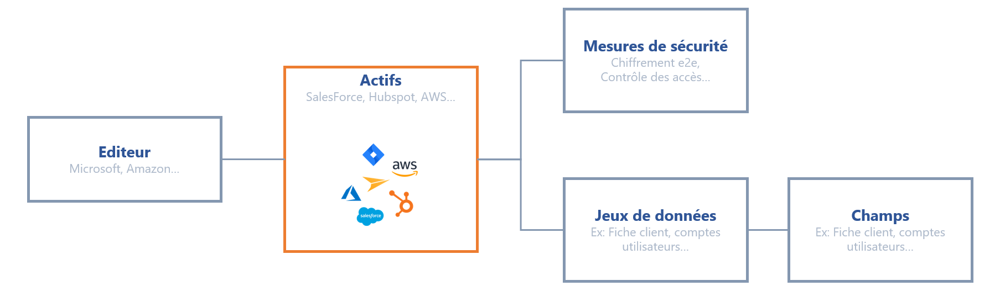

# Gegevens in kaart brengen

#### Het begint allemaal met het in kaart brengen van gegevens 

Voordat u begint met het maken van uw verwerkingsbladen, raden wij u aan om de gegevens van uw bedrijf zo nauwkeurig mogelijk in kaart te brengen. Het onderstaande diagram toont de mappingstructuur die u kunt gebruiken.

<figure><figcaption>
Data mapping diagram 
</figcaption></figure>

Om een inventarisatie te maken van alle persoonlijke gegevens in je IS, is dit de procedure die je moet volgen:

1. **Identificeer de Activa**, dat kan software zijn, bestanden, plugins, servers, machines, enz.
2. **Identificeer de uitgever van de Activa (indien van toepassing)**: voer de gegevens in van het bedrijf dat de Activa produceert. Dit kan worden vermeld onder onderaannemers bij het aanmaken van het register.
3. **Gegevens opslaan**: vermeld de bijbehorende dataset(s) (u kunt verwijzen naar de DPA die is ondertekend met de onderaannemer). Klik hier voor meer informatie over [de datasets] (https://doc.dastra.eu/features/editer-le-registre/remplir-le-questionnaire/categorie-de-donnees).
4. **Lijst de geïmplementeerde beveiligingsmaatregelen**

Met deze mapping wordt het veel eenvoudiger om verwerkingsfiches op te stellen op basis van de realiteit van uw gegevens.

Als je deze inventarisatie niet wilt maken, of je denkt dat de software die je gebruikt standaard is, dan hebben we het voor je geregeld. We hebben het onder controle: u kunt uw Activa repository maken met behulp van onze bibliotheek van voorgedefinieerde sjablonen met standaard marktactiva (Salesforce, Jira, enz.).