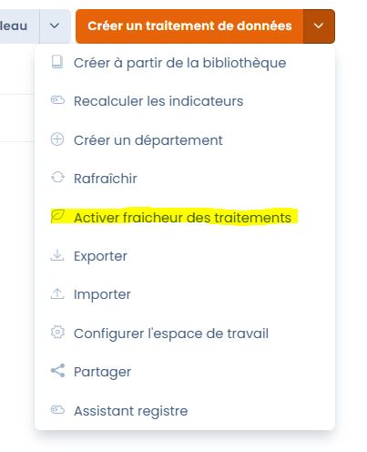
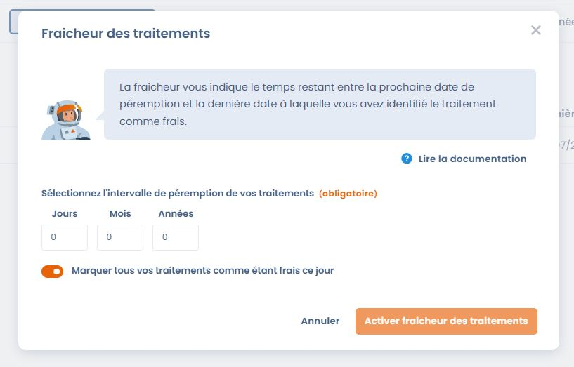
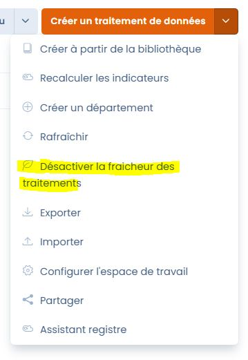

# Verwerking frisheid

### Wat is de indicator Frisheid van een behandeling?

De frisheid van een behandeling geeft aan wanneer een behandeling voor het laatst is gecontroleerd. De frisheid gaat achteruit naarmate de vervaldatum van de behandeling nadert. Deze functie is een eenvoudige en leuke manier om ervoor te zorgen dat de informatie in uw register voor verwerkingen regelmatig wordt gecontroleerd.&#x20;

<figure><figcaption>
Schematisch diagram van hoe de indicator voor de Frisheid van de behandeling werkt
</figcaption></figure>

### Hoe activeer ik de frisheidsindicator van de behandeling?

Verwerking is optioneel en is standaard uitgeschakeld &#x20;

Om de optie te activeren, gaat u naar uw verwerkingsregister, klikt u op de actiekiezer voor de knop "Gegevensverwerking aanmaken" en vervolgens op "Verwerkingsfrisheid activeren" &#x20;

Deze actie is voorbehouden aan beheerders van je werkruimte.

<figure><figcaption></figcaption></figure>

Het volgende venster verschijnt, waarin je de optie hebt om de **vervaldatum** voor je Verwerkingen in te stellen. De frisheid van een behandeling komt overeen met het aantal dagen tussen de laatste datum waarop de behandeling als vers werd gemarkeerd en de vervaldatum &#x20 van de behandeling;

De vervaldatum is een datum in de toekomst berekend vanaf de laatste datum waarop de Verwerking als vers werd gemarkeerd, waaraan we **het vervalinterval** toevoegen. Houd er rekening mee dat deze vervaldatum hetzelfde is voor alle Verwerkingen in uw register &#x20;

Met een tweede optie kunt u alle behandelingen in uw register als vers markeren wanneer de optie is geactiveerd (hiermee start u onmiddellijk een frisheidscyclus voor alle behandelingen in het register).

<figure><figcaption></figcaption></figure>

Voorbeeld: Het is 04/07/2023, ik activeer de frisheid optie in mijn register en stel een vervalinterval van 1 maand in. Ik vink de optie "markeer al uw Verwerkingen als vers op deze dag" aan en valideer. De vervaldatum voor mijn Verwerkingen wordt berekend als 04/08/2023 (laatste datum waarop mijn Verwerkingen als vers werden gemarkeerd, 04/07/2023, waarbij we het vervalinterval, 1 maand, optellen). Ik maak opnieuw verbinding op 15/07/2023 en mijn behandelingen hebben nog 20 dagen frisheid over (verschil tussen de vervaldatum en de datum van vandaag);

### De frisheidsoptie voor verwerkingen uitschakelen

Om de optie te deactiveren, gaat u naar uw verwerkingsregister, klikt u op de actiekeuzeknop voor "Een gegevensverwerking aanmaken" en vervolgens op "Deactiveer de optie frisheid van de gegevensverwerking".

Deze actie is voorbehouden aan uw werkruimtebeheerders.

Elke Verwerking behoudt de laatste datum waarop deze als vers werd gemarkeerd als je besluit de optie in de toekomst opnieuw in te schakelen.

<figure><figcaption></figcaption></figure>

### frisheidsindicatoren

Zodra de optie is geactiveerd, vind je op verschillende plaatsen frisheidsindicatoren voor je Verwerkingen&#x20;

Houd er rekening mee dat de frisheid alleen wordt weergegeven voor **gepubliceerde behandelingen** die ten minste **één keer als vers** zijn gemarkeerd (wanneer de optie is geactiveerd via de selector "Markeer al uw behandelingen als vers deze dag" of handmatig op een behandelingsrecord).

#### In het rechtermenu van uw Verwerking&#x20;

U vindt de frisheidsindicator rechtsboven in uw dossier (als de behandeling ten minste één keer als vers is gepubliceerd en gemarkeerd).

Deze indicator bestaat uit een label met de waarden "Vers", "Relatief vers" en "Verlopen", een kleur (respectievelijk richting, geel, rood), een voortgangsbalk die afneemt naarmate de vervaldatum nadert, een knop om de Verwerking als vers te markeren en het aantal resterende dagen of te laat ten opzichte van de vervaldatum.&#x20;

<figure><figcaption></figcaption></figure>

<figure><figcaption>
In mobiele weergave vind je deze indicator ook in de navigatiebalk boven aan je Verwerking
</figcaption></figure>

<figure><figcaption>
Voorbeeld van verlopen Verwerking
</figcaption></figure>

#### In de frisheidskolom van uw Verwerkingsregister

Als u de kolom frisheid weergeeft in de lijstweergave van uw behandelingsregister, kunt u de indicator vinden voor elke Verwerking die voldoet aan de weergavevoorwaarden (gepubliceerde Verwerking met ten minste één datum waarop deze als vers is geïdentificeerd)\.

<figure><figcaption>
frisheidskolom in een register van de verwerkingsactiviteiten waarbij de optie Verversing actief is
</figcaption></figure>.

### Verwerking vernieuwen

U kunt op elk moment besluiten om een Verwerking te verversen, zonder dat u op de vervaldatum hoeft te wachten. Klik hiervoor op "als vers markeren" om het venster voor het verversen van een behandeling weer te geven (in mobiele weergave kan dit venster worden geopend door op het bladverversingspictogram te klikken) :

<figure><figcaption>
venster voor het verversen van een behandeling
</figcaption></figure>

Door de Verwerking als vers te markeren, start je een frisheidscyclus vanaf de datum van vandaag tot de volgende vervaldatum. De vervaldatum wordt standaard berekend volgens het frisheidsbeleid van je werkruimte (frisheidsinterval dat wordt toegepast wanneer de optie Verwerking vers is geactiveerd). Je kunt besluiten om deze standaarddatum te negeren en een specifieke vervaldatum toe te passen op deze Verwerking door de optie "Vervaldatum wijzigen" aan te vinken en een nieuwe datum te selecteren (de vervaldatum moet minstens D+1 zijn).

### Belangrijke informatie over hoe frisheid werkt

Houd er rekening mee dat we de datum waarop een behandelingsrecord wordt bijgewerkt (bijvoorbeeld wanneer de record wordt opgeslagen) onafhankelijk Verwerken van de datum waarop een behandeling als vers werd geïdentificeerd. Daarom moet u op "als vers markeren" klikken om de frisheidsdatum van een Verwerking (opnieuw) te initialiseren.

### Meldingen

De eigenaar van een behandeling die verouderd is, ontvangt een waarschuwingse-mail om hem eraan te herinneren dat een van zijn Verwerkingen al lang niet meer is bekeken en dat het tijd is om hem te verversen.