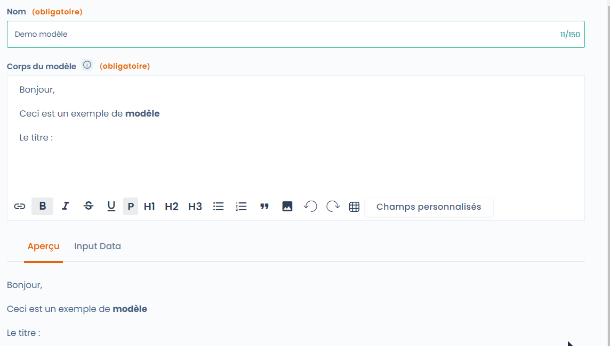
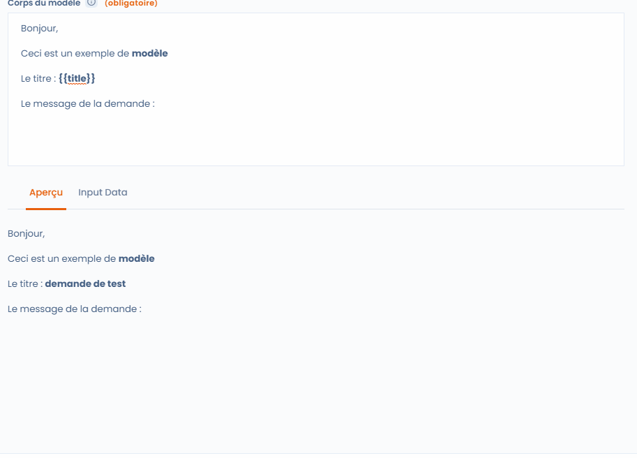

# E-mailsjablonen

## Algemeen

E-mailsjablonen zijn een functie van wetoefeningen, aangepaste workflows en audits.

Eenmaal opgeslagen zijn ze een snelle manier om met belanghebbenden te communiceren. De gegevensset van een object kan erin worden opgenomen en het is zelfs mogelijk om voorwaarden en lussen in te stellen om meer informatie op te halen.

## Gebruik

Om een model te selecteren of te maken, klik je op "Selecteer of maak een model".

<figure><figcaption><p>Het sjabloon selecteren in een rechter oefening</p></figcaption></figure>

Je kunt vervolgens een bestaand sjabloon zoeken in de lijst of de zoekfunctie, of kijken naar de sjablonen die beschikbaar zijn in de werkruimten waartoe je toegang hebt of de sjablonen die door Dastra zijn gemaakt.

Als er geen sjabloon voor u geschikt is, klikt u op "Sjabloon maken".

<figure><figcaption><p>Een sjabloon selecteren of maken</p></figcaption></figure>

De interface voor het maken van sjablonen bestaat uit 4 elementen&#x20;

* De naam (zodat de sjabloon later kan worden gevonden)
* Het invoergebied (de body van het sjabloon, groen omkaderd)
* Een voorbeeldtabblad: hiermee kunt u zien hoe de e-mail er in realtime uit komt te zien
* Een tabblad Invoergegevens: hiermee kunt u de gegevens bekijken voor het object waarop de sjabloon betrekking heeft.

<figure><figcaption><p>Interface voor het maken van sjablonen</p></figcaption></figure>

## De sjabloon aanpassen

Je kunt de sjabloon bewerken en naar wens stijlen toepassen, afbeeldingen of tabellen invoegen. Het resultaat zie je op het tabblad Voorbeeld. Als je op "Aangepaste velden" klikt, krijg je toegang tot een lijst met velden die je kunt invoegen. De waarde van het veld wordt ingevoegd ter hoogte van de muiscursor. Natuurlijk kun je de tekst opmaken zoals je wilt.

<figure><figcaption><p>Gebruik aangepaste velden</p></figcaption></figure>

## Verder gaan met aangepaste velden

Zoals je in de bovenstaande animatie kunt zien, zijn de velden met dubbele accolades "variabelen". Met andere woorden, ze worden vervangen door de waarden van het overeenkomstige object (in dit geval een verzoek voor het uitoefenen van rechten).

### Nieuwe aangepaste velden maken van invoergegevens

Door op het tabblad 'Invoergegevens' te klikken, krijg je toegang tot de lijst met eigenschappen van het gekoppelde object. In het onderstaande voorbeeld besluit ik het bericht weer te geven dat gekoppeld is aan de aanvraag:&#x20;

* Ik zoek het veld in "Invoergegevens".
* Ik voer de naam van het veld in de body van het bericht in met de syntax {{message}}.
* Ik controleer het resultaat met behulp van het tabblad "Voorbeeld".

<figure><figcaption><p>Een aangepast veld maken van invoergegevens</p></figcaption></figure>

Dat is het! Je kunt nu je eigen aangepaste velden maken. Maar dat is nog niet alles! Je kunt ook nog verder gaan door lussen en voorwaarden te maken en indelingen toe te passen om datums leesbaarder te maken!

### Voorwaarden

Je kunt ook voorwaardelijke blokken maken die alleen onder bepaalde voorwaarden worden weergegeven.

Om dit te doen, moet je het voorwaardelijke labelsysteem gebruiken dat begint met {% if qqch == true %\} en eindigt met {% endif %\}.

&#x20;Dus ik kan de volgende voorwaarde schrijven:&#x20;

> \{% if attachments != blank %\}
>
> Je hebt een bijlage
>
> \{% endif %\}

Het blok wordt alleen weergegeven als er een bijlage aanwezig is in het verzoek.

### Lussen

Lussen werken op dezelfde manier, behalve dat we deze keer een variabele intern in de lus genereren.

Het werkt als volgt:&#x20;

```vloeistof


  {{ purpose }}

i
```

In het bovenstaande voorbeeld verklaar ik dat ik door de lijst "purposes" wil lussen en de variabele "_purposes_" wil toewijzen aan elk item dat ik direct weergeef.

### Datumnotatie

Je zult snel zien dat de datums die je uit Invoergegevens haalt, niet presenteerbaar zijn zoals ze zijn. Geen probleem, je kunt een formaat aan de datum toekennen.

> \{{dateCreation | date: "%d-%m-%Y à %H:%M"\}}
>
> Wordt omgezet in 15-03-2023 om 15:40

### Een complexer voorbeeld

De onderstaande tekst gebruikt alle bovenstaande elementen

> Goedemorgen,
>
> Wij hebben uw verzoek ontvangen om uw rechten uit te oefenen op \{{dateCreation | date: "%d-%m-%Y à %H:%M"\}} betreffende de heer of mevrouw \{{givenName\}} \{{familyName\}}.
>
> Het verzoek heeft betrekking op de volgende doeleinden:
>
> \{% for purpose in purposes %\}
>
> * \{{ purpose \}}
>
> \{% endfor %\}
>
> \{% if attachments != blank %\}
>
>
> Wij hebben de volgende documenten ontvangen:
>
> \{% for attachment in attachments %\}
>
> * \{{ attachment.fileName \}}
>
> \{% endfor %\}
>
> \{% endif %\}
>
> Ik zal u op de hoogte houden van de voortgang van uw verzoek.
>
> Hoogachtend
>
> \{{operator.displayName\}}

Het verzoek dat momenteel in Verwerking is, wordt als volgt omgezet:&#x20;

<figure><figcaption><p>Een voorbeeld van een compleet sjabloon</p></figcaption></figure>

### Hebt u nog vereisten?

U kunt de documentatie raadplegen op het volgende adres: [https://shopify.github.io/liquid/](https://shopify.github.io/liquid/)