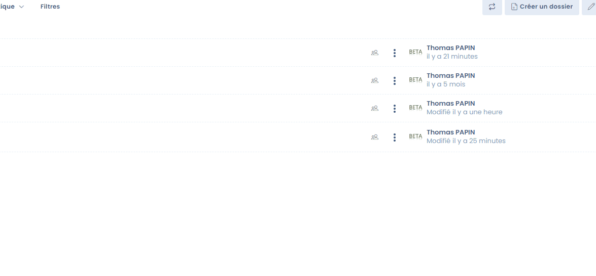

# Documentbeheer 

Dastra integreert standaard een document management functie &#x20;

Met deze module kunt u de toegang tot alle gerelateerde documenten in Dastra centraliseren en delen.

Hier kunt u bijvoorbeeld alle documentatie opslaan die u nodig hebt om aan te tonen dat u voldoet aan de AVG.


**Focus op AVG documentatie**

&#x20;

De documentatievereiste komt voort uit het verantwoordingsbeginsel van artikel 24 van de AVG.

In de praktijk neemt deze documentatie voornamelijk de vorm aan van een register van de verwerkingsactiviteiten, maar ook van andere elementen van gegevensbeheer en naleving van de AVG. **Deze kunnen het volgende omvatten (niet-limitatieve lijst):** * interne procedures voor het creëren van gegevensbestanden

* interne procedures voor het creëren van een nieuwe verwerking van persoonsgegevens (interne controle, risico- en evenredigheidsbeoordeling, enz.)
* procedure voor het uitvoeren van PIA's
* opstellen van een schriftelijk en bindend gegevensbeschermingsbeleid, waarmee rekening moet worden gehouden en dat moet worden toegepast op nieuwe gegevensverwerking (bijv. naleving van gegevenskwaliteitscriteria, voorafgaande kennisgeving, beveiligingsbeginselen, raadpleging, enz.)
* in kaart brengen van procedures om ervoor te zorgen dat alle gegevensverwerking naar behoren wordt geïdentificeerd, en beheer van een inventaris van gegevensverwerking
* het opzetten van opleidingsprogramma's voor mensen die verantwoordelijk zijn voor het beheer van gegevensverwerking
* het opzetten van procedures voor het beheer van verzoeken om toegang, rectificatie en verwijdering van gegevens en de rechten van betrokkenen ten aanzien van hun gegevens
* het opzetten van een intern klachtenbehandelingsmechanisme
* het ontwikkelen van interne procedures voor het effectief beheren en melden van datalekken
* het uitvoeren van privacyeffectbeoordelingen in bepaalde omstandigheden
* implementatie van en toezicht op verificatieprocedures om ervoor te zorgen dat alle maatregelen niet alleen op papier bestaan, maar ook worden geïmplementeerd en in de praktijk werken (interne of externe audits, enz.).

U kunt deze ruimte ook gebruiken voor **het opslaan van documenten die nuttig kunnen zijn voor het begrijpen van de Verwerking, trainingsnotities en eventuele contracten die de Verwerking regelen**.


### Geaccepteerde formaten

Vele formaten worden geaccepteerd:

* pdf
* Word
* Excel
* jpg
* zip
* etc

Als een formaat niet wordt geaccepteerd, kun je het bestand in een .zip-archief plaatsen om het in de documentatie op te nemen &#x20;

### Een document maken

Met Dastra kunt u snel een document maken om aantekeningen te maken &#x20;

Ga hiervoor naar documentbeheer en klik op "Een document schrijven".

&#x20;

<figure><figcaption>
Schrijf een nieuw document
</figcaption></figure>

Het nieuwe document wordt opgeslagen in markdown-indeling (.md)

<figure><figcaption></figcaption></figure>

### Een map maken

U kunt uw documenten in mappen opslaan zodat u ze gemakkelijk kunt terugvinden &#x20;

Het is mogelijk om submappen te maken.

<figure><figcaption></figcaption></figure>

### Rechtenbeheer

Je kunt rechten toevoegen aan mappen en bestanden in het EDM. Deze rechten kunnen worden toegewezen aan zowel mappen als bestanden en kunnen worden geconfigureerd door de beheerder van de werkruimte of een gebruiker met de machtiging "Bestandsbeheer: beheer".


Belangrijk: Standaard worden er geen beperkingen toegepast op de mappenstructuur. Machtigingen gekoppeld aan de rollen van de gebruiker worden echter toegepast !&#x20;


De eigenaar van de werkruimte (of beheerder) kan toegangsrechten configureren door op het configuratiepictogram op de overeenkomstige regel te klikken. Ze kunnen dan toegang configureren door teams en gebruikers toe te voegen met de bijbehorende uitvoeringsrechten.

&#x20;

<figure><figcaption>
Interface beheer interface
</figcaption></figure>

Deze machtigingen worden toegepast op alle "kind"-items (d.w.z. alle items in de map, dus ook submappen).&#x20;


Een map waarvoor geen rechten zijn gedefinieerd, wordt beschouwd als toegankelijk voor alle gebruikers.

Als er permissies zijn gedefinieerd of geërfd op een item, wordt het verborgen voor gebruikers die niet de benodigde machtiging hebben.
