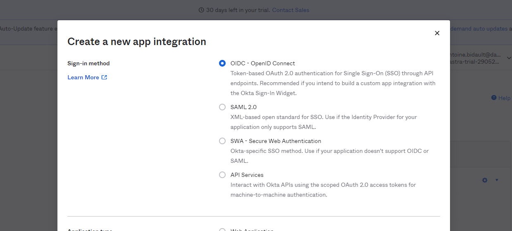
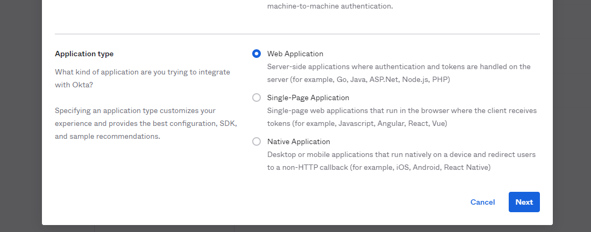
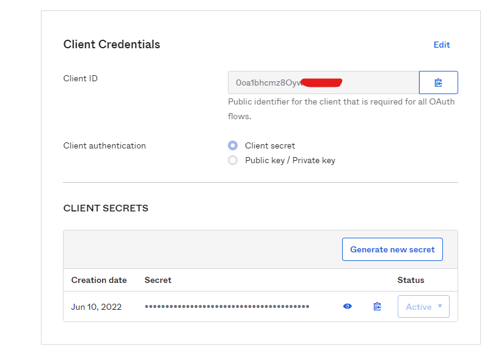

# Okta

Hier wordt uitgelegd hoe u de Okta login in SSO in Dastra kunt configureren met behulp van het **OpenId Connect** protocol. Merk op dat het ook mogelijk is om dit te doen met behulp van SAML.

**Stap 1: ga naar **Okta administrator backoffice**.

**Stap 2:** ga naar het menu **"Applications" > "Applications".** Klik op de knop **"Create App Integration"**.

**Stap 3**: Selecteer "**OIDC - OpenID Connect**".

**Stap 3**: Selecteer het toepassingstype "**Webtoepassing**".

**Stap 4: Configureer de applicatie als volgt, vink het vakje "**Impliciet**" aan.

Voor het applicatie logo, kunt u [deze gebruiken](https://www.dastra.eu/images/logo-dastra-dark.png)

**Stap 5** : In dit stadium moet je een _Dastra_ omleiding instellen in je _Okta_ applicatie. Ga hiervoor terug naar de _Dastra_ applicatie, [in de SSO beheerpagina](https://app.dastra.eu/general-settings/sso). Klik op "**Nieuwe SSO login**", en onderaan het formulier ziet u een redirection url die u moet kopiëren.

**Stap 6**: Ga terug naar Okta, en plak de omleidingsurl in het juiste veld, selecteer de Okta-gebruikers aan wie u toegang wilt verlenen tot Dastra (standaard kunt u "Iedereen toestaan" aanvinken) en klik dan op "**Opslaan**".

**Stap 7**: Je bent er bijna! Je wordt doorgestuurd naar een pagina met alle instellingen voor de nieuwe SSO app: Client Id, Secret Key en Domain/Authority.

Let op dat je het domein gebruikt met het [https:// protocol](../../../.gitbook/assets/okta-domain.png)

**Stap 8: Ga terug naar **Dastra** en vul de formuliervelden als volgt in:&#x20;

* **Klant-ID**: kopieer de klant-ID uit Okta &#x20;
* **Autoriteit/Domein** : **Vul het domein in met het protocol (https://.okta.com).
* Issuer**: leeg laten &#x20;
* Geheime sleutel**: Kopieer de geheime sleutel van Okta.
* Scope**: openid profiel e-mail &#x20;
* **Response type**: id_token

**Stap 8**: Klik op "Opslaan" => Voer dan een test uit door op de "Test" knop te klikken! Als je succesvol wordt doorgestuurd naar Dastra! Het is je gelukt!
